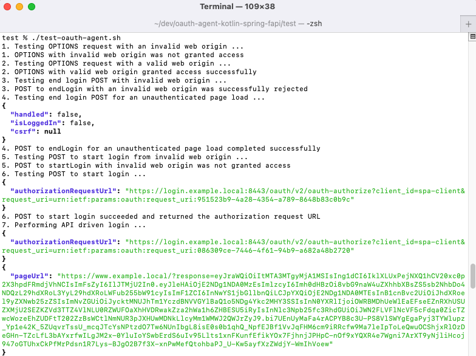

# How to Run the Financial-grade Token Handler Locally

Follow the below steps to get set up for developing and testing the token handler itself.

## Prerequisites

Ensure that these tools are installed locally:

- [Java 11 or later](https://openjdk.java.net/projects/jdk/11/)
- [Docker Desktop](https://www.docker.com/products/docker-desktop)
- [jq](https://stedolan.github.io/jq/download/)
- [OpenSSL](https://www.openssl.org/source/)

Also get a license file for the Curity Identity Server with support for financial-grade features.

## Update your Hosts File

Ensure that the hosts file contains the following development domain names:

```text
127.0.0.1  api.example.local login.example.local
:1 localhost
```

## Understand URLs

For local development of the token handler the following URLs are used:

| Component | Base URL | Usage |
| --------- | -------- | ----- |
| Token Handler API | https://api.example.local:8080/tokenhandler | This acts as a Back End for Front End for SPAs |
| Curity Identity Server | https://login.example.local:8443 | This will receive a Mutual TLS secret from the token handler | 

## Generate Certificates

Run this script to create development certificates for the above domains: 

```bash
cd certs
./create-certs.sh
```

## Configure Java SSL Trust

Run the following command from the root folder to configure the token handler API to trust the root certificate:  

```bash
sudo "$JAVA_HOME/bin/keytool" -import -alias example.ca -cacerts -file ./certs/example.ca.pem -storepass changeit -noprompt
```

Remove trust when finished with testing or if you need to update the root certificate: 

```bash
sudo "$JAVA_HOME/bin/keytool" -delete -alias example.ca -cacerts -storepass changeit -noprompt
```

## Build and Run the Token Handler API

Run this command from the root folder and the API will then listen on SSL over port 8080.\
Alternatively the API can be run in an IDE of your choice:

```bash
./gradlew bootRun
```

Test that the API is contactable by running this command from the root folder:

```bash
curl --cacert ./certs/example.ca.pem -X POST https://api.example.local:8080/tokenhandler/login/start \
-H "origin: https://www.example.local" | jq
```

## Deploy the Curity Identity Server

Copy a license file into the `test/idsvr` folder and then run the following commands:

```bash
cd test/idsvr
./deploy.sh
```

## Test the Token Handler API

The test script can then be used to verify the token handler's operations using the curl tool:

```bash
cd test
./test-token-handler.sh
```



## Free Docker Resources

When finished with your development session, free Docker resources like this:

```bash
cd test/idsvr
./teardown.sh
```